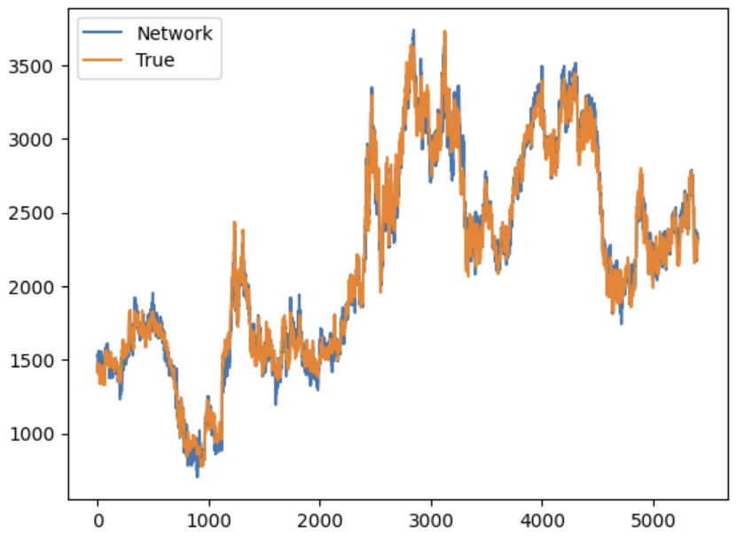
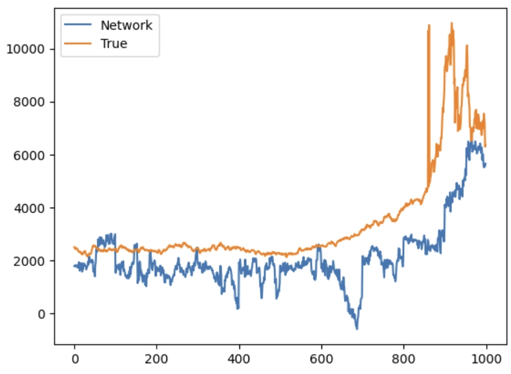

```{R setup, include = FALSE}
library(dplyr)
library(ggplot2)
library(mgcv)
library(Hmisc)
library(Pmisc)
library(astsa)
library(tseries)
library(forecast)
library(GET)
library(zoo)
library(tidyr)
library(readr)
library(knitr)

knitr::opts_chunk$set(fig.pos = 'H', echo = FALSE, message = FALSE, warning = FALSE)
```

# Introduction
Cocoa is an important agricultural product, especially for some West African countries like Ghana and Côte d’Ivoire (). These two nations produce more than half of the world’s cocoa supply. Therefore, changes in cocoa prices have very important effects on their economies and the income of farmers. This study aims to find the key factors that influence cocoa futures prices. The primary purpose is to develop forecasting models that help predict future price movements.

Cocoa prices often change due to external shocks. Climate change is one major factor. Studies show that abnormal weather can harm cocoa trees and reduce production. This supply shortage often causes prices to rise sharply. For example, in Ghana and Côte d’Ivoire, rising temperatures and irregular rainfall have already created serious problems for cocoa farmers ( ). Also, inflation and changes in exchange rates can change production costs and influence market demand. When inflation increases in cocoa-importing countries or the U.S. dollar strengthens, cocoa prices become more unstable ( ). Another important factor is the disease of the cocoa trees, which are susceptible to pests and viruses, such as the swollen shoot virus. These diseases reduce the number of healthy trees, leading prices to increase due to lower production ( ). All these factors are connected and must be considered together when modeling cocoa prices.

In this report, we will use time series forecasting models, including ARIMA and linear regression with exogenous variables. These models will help identify patterns of cocoa price predictions. The analysis is based on historical data and includes climate, economic, and agricultural indicators.

There are some key challenges in this study. The data may be missing or incomplete. Also, some time series are non-stationary, which means their trends change over time. Finally, combining different types of data can be very complex. To solve these problems, we will use careful preprocessing steps and test different models to choose the most accurate and reliable one.


# Literature Review


# Data


# Methodology
We split our data into a training set and a test set using a 80% - 20% ratio. Besides the daily price data, we extract a monthly and yearly time series data by averaging all price in one month or one year to see if our models are robust enough to train on those data. For NA and missing values in the dataset, we interpolate the data directly. 

## Preliminary Model - ARIMA

## Model Ensemble - ARIMA + Linear Model

## ARIMAX
The dependence of the price on other factors such as weather and diseases may be important. Therefore, we choose to use a conditional ARIMA model which is called autoregressive integrated mean average with exogenous variables (ARIMAX). It takes care of the dependence of the time series price with other time series with an expression:

$$y_t=\Phi(B)(1-B)^dy_t=\Theta(B)\epsilon_t+\mathbb{\beta}^T\mathbb{x}_t$$
where $\epsilon_t$ is a white noise sequence and $x_t$ is our exogenous variable. If we expand this, we can get 

$$
y_t = \phi_1 y_{t-1} + \phi_2 y_{t-2} + \cdots + \phi_p y_{t-p} 
+ \theta_1 \epsilon_{t-1} + \theta_2 \epsilon_{t-2} + \cdots + \theta_q \epsilon_{t-q} 
+ \beta_1 x_{1,t} + \beta_2 x_{2,t} + \cdots + \beta_k x_{k,t} + \epsilon_t
$$

This is a kind of conditional ARIMA, where our time series of interest is conditioned on other variables that are potentially influential. With that, we may be able to predict the price more accurately using the other variables. In practice, we use price as the $y$ variable and we treat everything else in the dataset as the $X$ variable. The ARIMA parameters are chosen based on inspection and model selection techniques such as AIC and MSE. The model is then fitted using a standard ARIMA technique. 

## Linear Regression on Lags

## Temporal CNN

Convolutional neural network (CNN) is a popular machine learning model when dealing with image and sequential data. More precisely, when it comes to univariate time series data in our case, we will perform a 1d convolution, which basically convolves some kernels with the predefined receptive field before time step $t$. After that, take the loss function as that distance between the predicted time series and our training data then backpropagate the gradient as in usual machine learning practice. CNN can easily extract temporal dependence inherently. We are using dilation on CNN to better extract the feature. 

More specifically, we are using an encoder-decoder structure. We encode the time series and the corresponding exogenous time series using temporal CNN into some hidden state. We treat different features of the time series as different channels. In this process, we also utilize recurrent neural networks (RNN) to make the network respect the long term dependency. The encoder consists of many residual blocks. Then, using multi-layer perceptrons (MLP), we construct a decoder to predict future values conditioned on the past time series as well as the exogenous variables. The model is fully differentiable so we optimize it using an AdamW optimizer with appropriate hyperparameters tuned by the validation error on a test set splitted from the dataset. 


# Results and Forecasting
## Preliminary Model

## Model Ensemble - ARIMA + Linear Model

## ARIMAX

The ARIMAX model is fitted using daily data as well as the monthly data with parameter (10,2,1). The inference results on the monthly and daily data can be seen from the diagram below.  We can see that the result is relatively bad although we take into consideration other factors. It is similar to the results with a vanilla ARIMA model: the predicted time series becomes straight as a line, the error bar is enormous compared to the scale of the time series. The overall upward trend is correct except for the drastically increasing. This shows that the model is very uncertain on its prediction, and simply cannot fit the data because of its complexity. This suggests that ARIMAX is not a good choice for this data. 

```{R}
data <- read.csv("Prices.csv", header = TRUE, stringsAsFactors = FALSE)
conditional_data <- read.csv("Ghana_data.csv", header = TRUE)
GH_price <- read.csv("USD_GHS Historical Data.csv", header = TRUE)
```

```{R}
data$Date <- as.Date(data$Date, format = "%d/%m/%Y")
data$Price <- as.numeric(data$Price)
```

```{R}
data <- data[order(data$Date), ]
start_date <- min(data$Date)
start_year <- as.numeric(format(start_date, "%Y"))
start_day <- as.numeric(format(start_date, "%j"))
price_ts <- ts(data$Price, start = c(start_year, start_day), frequency = 12)
```


```{R}
day_full <- read_csv("day_full.csv", na = "0", show_col_types = FALSE)

day_full <- day_full %>%
  mutate(across(where(is.character), ~ suppressWarnings(as.numeric(.)))) 

day_full <- day_full %>%
  arrange(Date) %>%
  mutate(across(where(is.numeric), ~ na.approx(., na.rm = FALSE)))

n <- nrow(day_full)
split_index <- floor(0.8 * n)

day_full_train <- day_full[1:split_index, ]
day_full_test <- day_full[(split_index + 1):n, ]
```

```{R}
price_train = ts(day_full_train %>% select("Price"), frequency = 365)
reg_clean_train = day_full_train %>%
  select(-Date, -Price) %>%
  as.matrix()

reg_clean_test = day_full_test %>%
  select(-Date, -Price) %>%
  as.matrix()

model = Arima(price_train, order=c(10,2,1), xreg = reg_clean_train)

price_test <- ts(day_full_test$Price, start = end(price_train)[1] + 1, frequency = 365)

forecast_result = forecast(model, h = 10, xreg = reg_clean_test)

```

```{R}
#| fig-cap: ARIMAX model fitted on daily data.
# Plot forecast vs actual
autoplot(forecast_result) +
  autolayer(price_test, series = "Actual") +
  labs(title = "ARIMA Forecast vs Actual", x = "Time", y = "Price")
```


```{R}
month_full <- read_csv("month_data_full.csv", show_col_types = FALSE)

month_full <- month_full %>%
  mutate(across(where(is.character), ~ as.numeric(.)))

month_full <- month_full %>%
  arrange(Date) %>%
  mutate(across(where(is.numeric), ~ na.approx(., na.rm = FALSE)))
```
```{R}
n <- nrow(month_full)
split_index <- floor(0.8 * n)

month_full_train <- month_full[1:split_index, ]
month_full_test <- month_full[(split_index + 1):n, ]
```

```{R}
price_train = ts(month_full_train %>% select("Price"), frequency = 12)
reg_clean_train = month_full_train %>%
  select(-Date, -Price) %>%
  as.matrix()

reg_clean_test = month_full_test %>%
  select(-Date, -Price) %>%
  as.matrix()

model = Arima(price_train, order=c(6,2,1), xreg = reg_clean_train)
summary(model)

price_test <- ts(month_full_test$Price, start = end(price_train)[1] + 1, frequency = 12)

forecast_result = forecast(model, h = 1, xreg = reg_clean_test)
```

```{R}
#| fig-cap: ARIMAX model fitted on monthly data.
# Plot forecast vs actual
autoplot(forecast_result) +
  autolayer(price_test, series = "Actual") +
  labs(title = "ARIMA Forecast vs Actual", x = "Time", y = "Price")
```


## Linear Regression on Lags

## Temporal CNN
It takes the CNN ~1000 epochs to converge to a low loss. The fitted time series on the training and test set are shown. We can see that the model performs extremely well on the training set, showing that the expressiveness of the model is sufficient to capture the training data. We can see that the trend of the time series is correctly predicted by the CNN, but there is still some deviations from the true test set. The validation MSE loss on the test set is also large. A potential reason is that the model is too complex and it overfits the given training set even though we apply a standard $L^2$ regularization  on its weights. Overly complex model may not be suitable for a time series prediction without good regularization. The loss curve is also shown below. 



```{r myimage, echo=FALSE, fig.cap="The performance of the CNN model on train set. "}  
```


# Discussion
Overall the traditional time series prediction methods all perform relatively bad on the cocoa global price dataset. This shows that this data has an inherently complex nature, and many models are bad at capturing the pattern of the data. Another factor that may be problematic is the stationarity of the time series, which is hard to achieve. Also, traditional models such as ARIMA may fail because they don’t take into consideration the exogenous variables such as weather and inflation. To resolve this, we found that the linear model trained on lags achieved a satisfying performance on both the training set and the generalization to the test set. Theoretically, temporal CNN will also perform well on this the performance of the linear model. However, due to issues like overfitting, the CNN model is not good as the linear model when predicting the future. 

Although the vanilla ensemble model does not perform well, we may use the idea to combine two equally good models and tune the weight between the outputs of the two models to gain a better result. Or we can use another function to dynamically combine the results given by two or more models. 

Data quality may also be important. We may incorporate more relevant data to train our models. 

Recently there are works on utilizing diffusion models for time series prediction [@diffusion], which achieve state-of-the-art performance. Using that, we may be able to fit a robust and well-generalized model on this complex dataset conditioned on other factors. The flexibility of the proposed model enables us to do that.

# Conclusion
