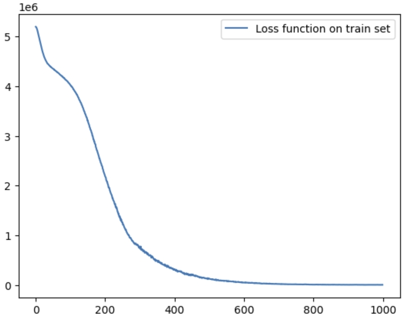
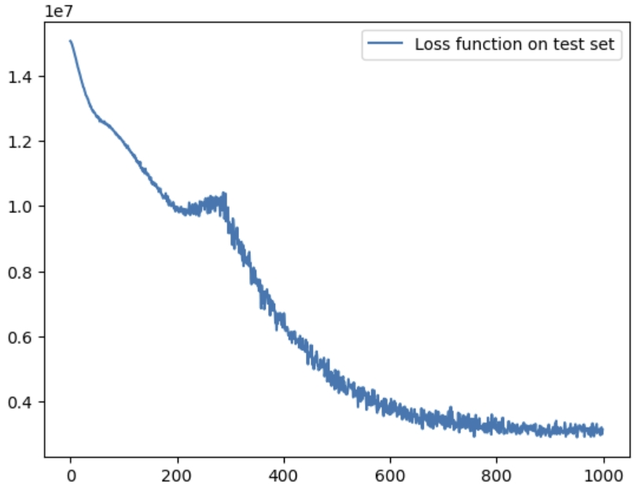

```{R setup, include = FALSE}
library(dplyr)
library(ggplot2)
library(mgcv)
library(Hmisc)
library(Pmisc)
library(astsa)
library(tseries)
library(forecast)
library(GET)
library(zoo)
library(tidyr)
library(readr)
library(lubridate)
library(knitr)
knitr::opts_chunk$set(fig.pos = 'H', echo = FALSE, message = FALSE, warning = FALSE)
```

# Introduction
Cocoa is an important agricultural product, especially for some West African countries like Ghana and Côte d’Ivoire (@climate). These two nations produce more than half of the world’s cocoa supply. Therefore, changes in cocoa prices have very important effects on their economies and the income of farmers. This study aims to find the key factors that influence cocoa futures prices. The primary purpose is to develop forecasting models that help predict future price movements.

Cocoa prices often change due to external shocks. Climate change is one major factor. Studies show that abnormal weather can harm cocoa trees and reduce production. This supply shortage often causes prices to rise sharply. For example, in Ghana and Côte d’Ivoire, rising temperatures and irregular rainfall have already created serious problems for cocoa farmers (@climate). Also, inflation and changes in exchange rates can change production costs and influence market demand. When inflation increases in cocoa-importing countries or the U.S. dollar strengthens, cocoa prices become more unstable (@exchange). Another important factor is the disease of the cocoa trees, which are susceptible to pests and viruses, such as the swollen shoot virus. These diseases reduce the number of healthy trees, leading prices to increase due to lower production (@disease). All these factors are connected and must be considered together when modeling cocoa prices.

In this report, we will use time series forecasting models, including ARIMA and linear regression with exogenous variables. These models will help identify patterns of cocoa price predictions. The analysis is based on historical data and includes climate, economic, and agricultural indicators.

There are some key challenges in this study. The data may be missing or incomplete. Also, some time series are non-stationary, which means their trends change over time. Finally, combining different types of data can be very complex. To solve these problems, we will use careful preprocessing steps and test different models to choose the most accurate and reliable one.

# Literature Review
Time series forecasting has been widely used for modeling commodity prices. Classical models like ARIMA and GARCH are popular due to their simplicity. However, these models assume the linearity and stationarity of the series, which do not hold for all real-world data. An increasing number of studies have started exploring machine learning methods, which can better capture non-linear patterns of the data.

A study in 2010 used univariate ARIMA models to predict cocoa bean prices (@ARIMA). The study tested ARIMA on monthly cocoa price data. It shows that ARIMA is very effective in capturing seasonality and trends. However, it cannot directly include the influence of the explanatory variables. Its performance is not very good when data is highly influenced by other factors. Our study uses ARIMA as our preliminary model, and given the problem mentioned above, we also built an ensemble model by combining the predictions from ARIMA and linear regression to improve the forecast. ARIMA captures trends and patterns over time, while linear regression focuses on relationships of cocoa prices with external variables. By averaging the predictions of these two models, the ensemble can reduce errors and balance the strengths of both approaches.

As mentioned before, this study also uses a linear regression model on its own to forecast cocoa futures prices. Linear regression is simple and allows the participation of external variables. Although it may not capture complex time series, it intuitively shows how each factor influences the price directly. 

Another model used in this study is ARIMAX, which extends the ARIMA model by including external variables. A recent study used ARIMAX to forecast California’s energy consumption using population, production levels, energy prices, and so on (@ARIMAX). Their results show that ARIMAX gives more accurate forecasts than ARIMA, especially when external variables highly influence the response variable. This supports the idea that adding predictors can improve model performance. In our study, ARIMAX is used to include temperature, precipitation, inflation rate and disease reports in cocoa-producing countries. This is better for modelling and forecasting real-world data than the univariate ARIMA approach.

In this study, we explore a convolutional neural network (CNN) approach to forecast cocoa futures prices. CNNs are well-known in image and speech recognition, and they are increasingly used for time series forecasting. Another study proposed a WaveNet-inspired CNN model for conditional time series forecasting. Their model uses dilated convolutions to learn long-term dependencies and can make forecasts based on multiple related time series. CNN uses fewer parameters than RNNs and is faster to train (@CNN). We applied a simplified version of the temporal CNN to test whether it can capture the cocoa prices when it's affected by temperature. 

# Data
```{r}
#| echo: False
#| warning: False

tropic <- read.csv("Tropical_Region_Temperature.csv")
inflation <- read.csv("world_inflation_rate_cpi.csv")
price <- read.csv("Daily_Prices_ICCO.csv")
Ghana_data <- read.csv("Ghana_data.csv")

ts_tropic <- ts(data = tropic$Tropical_Region_Temperature,
                start = c(1994,3,10),
                frequency = 365)

ts_inflation <- ts(data = inflation$Inflation_rate,
                   start = 1994,
                   frequency = 1)

price$Date <- rev(price$Date)
price$ICCO_daily_price <- rev(price$ICCO_daily_price)
ts_price <- ts(data = price$ICCO_daily_price,
               start = c(1994,3,10),
               end = c(2025),
               frequency = 252)

ghana_GHM00065472 <- Ghana_data %>% filter(STATION == "GHM00065472")

ts_ghana <- ts(data = ghana_GHM00065472$TAVG,
               start = c(1990,1,1),
               end = c(2024,11,28),
               frequency = 265)
```

## Tropical Region Temperature Data

The first dataset comprises daily tropical region temperature records, sourced from the Climate Reanalyzer platform. The integration of meteorological data is motivated by the hypothesis that temperature patterns in cocoa-growing regions may influence cocoa supply, and subsequently, cocoa prices.

This dataset, sourced from Climate Reanalyzer(https://climatereanalyzer.org/clim/t2_daily/?dm_id=tropics), covers daily mean temperatures in Celsius across the tropical region from March 10, 1994, through February 27, 2025, with each record containing the calendar date and the corresponding average temperature measurement.
  
The temperature data were accessed directly from the Climate Reanalyzer website, which aggregates global meteorological information from various reanalysis sources. The data used here focus specifically on the tropical region (defined roughly by latitudes 20°N to 20°S) since the majority of the world’s cocoa cultivation occurs within this belt.

This time‐series plot of tropical temperatures (in °F) from the mid‐1990s through the mid‐2020s shows both seasonal fluctuations and a modest long‐term upward trend. The regular peaks and troughs reflect recurring intra‐annual (most likely monthly or seasonal) variations in tropical climate.


```{r,fig.width=6, fig.height=3}
#| echo: False
#| fig-cap: Time‐series of tropical region mean temperatures from 1993 to 2025. This figure displays the monthly (or daily) average temperature (in °F) for the tropical belt, as recorded by Climate Reanalyzer. The data reveal a pronounced seasonal cycle, with distinct peaks and troughs each year, and a noticeable long‐term warming trend over the nearly three‐decade period. Short‐lived temperature extremes—visible as spikes—coincide with climate anomalies underscoring the influence of large‐scale ocean‐atmosphere interactions on tropical climate variability.

plot(ts_tropic)
```

## Cocoa Price Data

The cocoa market is highly sensitive to both global demand and local production conditions—often influenced by weather, political stability, and macroeconomic factors. In this study, we employ a daily cocoa price dataset to capture short-term market fluctuations that are otherwise obscured in lower-frequency (e.g., monthly or annual) data. By using daily prices, we aim for a more detailed view of volatility, price spikes, and potential market shocks.

This dataset, obtained from the International Cocoa Organization (ICCO), spans daily cocoa prices in USD per metric ton from October 1994 through February 2025, reflecting nominal values and often averaging London and New York futures quotes; each record contains the date of the price quote along with the daily cocoa price.

The ICCO compiles daily price data from major cocoa futures markets. If your specific CSV includes official ICCO daily prices, it often represents a composite index or an average of London and New York closing prices, converted to USD per ton.

```{r}
#| echo: False
#| warning: False

stats_price <- summary(ts_price)

# Convert the named vector to a data frame
stats_df_1 <- data.frame(
  Statistic = names(stats_price),
  Value     = as.numeric(stats_price)
)

# Now kable() will work
kable(stats_df_1, caption = "Descriptive Statistics for Cocoa Daily price")
```

From the mid‐1990s through approximately the mid‐2010s, cocoa prices displayed moderate fluctuations with a gentle upward trend, punctuated by several peaks likely linked to supply disruptions, demand surges, or broader economic events. 

```{r,fig.width=6, fig.height=3}
#| fig-cap: Daily Cocoa Prices (USD/ton) from the Early 1990s to Mid‐2020s. This line chart depicts the evolution of cocoa prices, as reported by the ICOO .The historical portion of the series (1990s to late 2010s) shows moderate fluctuations and cyclical trends—reflecting routine shifts in global supply and demand. However, from around 2020 onward, prices escalate rapidly, exceeding 10,000 USD/ton at their peak.
#| echo: False
#| warning: False

plot(ts_price,
     ylim = c(750,11000), caption = "Daily Cocoa Prices (USD/ton) from the Early 1990s to Mid‐2020s")
```

## World Inflation Data

In addition to temperature and cocoa price data, this study incorporates world inflation rate data to account for global macroeconomic conditions that may influence cocoa market prices. By including inflation, we can differentiate between nominal and real price fluctuations, thus obtaining a more accurate view of how cocoa prices evolve over time relative to general price levels.
This World Bank World Development Indicators dataset spans annual inflation rates, measured as the year-over-year percentage change in the consumer price index (CPI), from approximately 1994 through 2023; each entry includes the date, the observed inflation rate, and the corresponding annual percentage change.These inflation data are collected and reported by the World Bank from national statistical agencies. The CPI measures changes in the cost of a basket of goods and services, and its year-over-year percentage change reflects a country’s (or world’s) inflation rate.

Early 1990s to early 2020s: Global inflation fell before plateauing in the early 2000s.  The trend begins to rise in the mid-2000s and peaks after the global financial crisis of the late 2000s.  After falling again in the early 2010s, inflation rises sharply in the early 2020s, suggesting pandemic recovery, supply chain disruptions, and other macroeconomic variables are reviving inflationary pressures.

```{r,fig.width=6, fig.height=3}
#| fig-cap: Annual Global Inflation Rates, 1993–2023. This line plot illustrates the year‐to‐year percentage change in the consumer price index (CPI) on a global scale, as reported by the World Bank. Initially exceeding 10% in the early 1990s, the inflation rate descends through the decade, reaching below 3% around 2000. Subsequent years show moderate fluctuations, including a notable spike around 2010 and a further surge in the early 2020s.
#| echo: False
#| warning: False


plot(ts_inflation, caption = "Annual Global Inflation Rates, 1994–2023")
```

## Ghana Temperature data

This dataset contains daily temperature readings from weather stations in Ghana. By focusing on just one station, we capture location-specific climatic patterns such as local heat waves, precipitation effects, and microclimate conditions, without the averaging effects of multiple stations. This dataset features daily measurements in Fahrenheit, encompassing the period from January 1990 through December 2024. This station’s data were initially part of a larger dataset spanning multiple Ghanaian stations. The subset was created by filtering rows belonging to the chosen station.
This daily temperature data for a single station in Ghana shows regular short-term swings, often between the mid-70s and upper-80s °F, from 1990 to 2025.  The cyclical highs and lows show considerable seasonal influences, possibly related to wet and dry seasons in the region. 

```{r,fig.width=6, fig.height=3}
#| fig-cap: Daily Temperature Records for a Single Weather Station in Ghana, 1990–2025. This time‐series plot displays nearly four decades of daily temperature readings in Ghana (in °F). The data reveal a consistently tropical climate marked by distinct seasonal cycles, with temperatures oscillating on a near‐annual basis. Intra‐annual variability is evident between consecutive measurements. Spikes above 90°F potentially indicate significant heat events or pre‐rainy‐season conditions, whereas occasional dips closer to 70°F may reflect cooler, rain‐induced conditions or unseasonal weather anomalies. Overall, the long‐term pattern suggests the station has experienced relatively stable yet gradually warming conditions over the observed period.
#| echo: False
#| warning: False

plot(ts_ghana)
```

\newpage

# Methodology
We split our data into a training set and a test set using a 80% - 20% ratio. Besides the daily price data, we extract a monthly and yearly time series data by averaging all price in one month or one year to see if our models are robust enough to train on those data. For NA and missing values in the dataset, we interpolate the data directly. To evaluate the performance across different models, we use the RMSE (rooted mean square error) of a model on the test set as a metrics. A model with a lower RMSE would be considered to perform better on the test set. 

## Preliminary Model - ARIMA
First of all, we have chosen ARIMA to be our Preliminary model. As mentioned in the Literature Review, ARIMA seems to be one of the best models when it comes to predicting the price of Cocoa and our initial plot of cocoa price(figure 1) doesn’t seem to be stationary. In order for our ARIMA model to perform better, we need to find the best degree of difference and dependence order for our data. Since our data is non-stationary we apply a first difference ($d = 1$) to our data and re-assess. If the data is stationary, we continue to find the AR and MA Orders ($p$ and $q$), and if the first difference isn’t enough to make the data stationary we will introduce a second difference into our model and so on. After determining the degree of difference, we plot the Autocorrelation Function (ACF) and Partial Autocorrelation Function (PACF). A sharp cut-off in the PACF suggests the appropriate AR order ($p$) for our differenced data. And a sharp cut-off in the ACF is used to determine the MA order ($q$). Using the method above, we can find ARIMA models with appropriate degree of difference and dependence order. In general, we will write the model as
$$\Phi(B)(1 - B)^d y_t = \Theta(B) \varepsilon_t$$

where $\epsilon_t$ is the white noise sequence. In practice, we will use the function (ARIMA) in R to generate an ARIMA model for forecasting. 


## Model Ensemble - ARIMA + Linear Model
As good as our time domain approach time series model might be, it lacks consideration of influencing factors in Cocoa price such as climate change, disease and exchange rate. So to compensate for the lack of factors we decided to introduce an ensemble model which not only contains an ARIMA model, but also a linear model which includes factors influencing cocoa price as predictors. We will do the same as described in our preliminary model for the ARIMA part in the ensemble model. The linear regression model is going to be a little more complicated. Naturally we choose our response variable to be the price of the Cocoa, and our predictors to be factors that influence Cocoa price the most. This will give us a general equation for our linear model.
$$y_t=\sum_{i=1}^N\beta_i x_t^i+\epsilon$$
where $x_i^t$ are predictors $i$ at time $t$ and $\epsilon$ is the noise. The parameters of the linear model will be fitted using least square estimation (LSE). Then we will drop predictors using p-value and T-test (with alpha value being 0.05) to reduce redundancy in our model. Last but not the least, we need to combine the 2 models, because It is hard to evaluate fairly which model should have a higher weight. We decided to use a simple average approach to the ensemble model. This give us the equation for our model:
$$y_t=\frac{y^\text{ARIMA}_t+y^\text{LM}_t}{2}$$
The ensemble model is useful since our linear model and ARIMA model capture different aspects of the data and we want to combine their strengths.

## ARIMAX
The dependence of the price on other factors such as weather and diseases may be important. Therefore, we choose to use a conditional ARIMA model which is called autoregressive integrated mean average with exogenous variables (ARIMAX). It takes care of the dependence of the time series price with other time series with an expression:

$$y_t=\Phi(B)(1-B)^dy_t=\Theta(B)\epsilon_t+\mathbb{\beta}^T \boldsymbol{x}_t$$
where $\epsilon_t$ is a white noise sequence and $x_t$ is our exogenous variable. If we expand this, we can get 

$$
y_t = \phi_1 y_{t-1} + \phi_2 y_{t-2} + \cdots + \phi_p y_{t-p} 
+ \theta_1 \epsilon_{t-1} + \theta_2 \epsilon_{t-2} + \cdots + \theta_q \epsilon_{t-q} 
+ \beta_1 x_{1,t} + \beta_2 x_{2,t} + \cdots + \beta_k x_{k,t} + \epsilon_t
$$

This is a kind of conditional ARIMA, where our time series of interest is conditioned on other variables that are potentially influential. With that, we may be able to predict the price more accurately using the other variables. In practice, we use price as the $y$ variable and we treat everything else in the dataset as the $X$ variable. The ARIMA parameters are chosen based on inspection and model selection techniques such as AIC and MSE. The model is then fitted using a standard ARIMA technique. 

## Linear Regression on Lags
During our investigation on background information about Cocoa price, the most important factor which influenced the Cocoa price was the Cocoa price before. So we decided to introduce a linear regression model which contains the price of Cocoa leading to the prediction day. The method for building the linear regression on lags model is no different than our linear regression model in ensemble model. But this time we not only have final predictors in our ensemble model, but also price of Cocoa 1 day before to 10 days before. Then we will use the p-value and t-test again to determine which predictors to keep. The formula for this linear regression model is given by

$$y_t=\sum_{t=1}^{10}\alpha_ty_t+\sum_{i=1}^N\beta_ix_t^i+\epsilon$$

## Temporal CNN

Convolutional neural network (CNN) is a popular machine learning model when dealing with image and sequential data. More precisely, when it comes to univariate time series data in our case, we will perform a 1d convolution, which basically convolves some kernels with the predefined receptive field before time step $t$. After that, take the loss function as that distance between the predicted time series and our training data then backpropagate the gradient as in usual machine learning practice. CNN can easily extract temporal dependence inherently. We are using dilation on CNN to better extract the feature. 

More specifically, we are using an encoder-decoder structure. We encode the time series and the corresponding exogenous time series using temporal CNN into some hidden state. We treat different features of the time series as different channels. In this process, we also utilize recurrent neural networks (RNN) to make the network respect the long term dependency. The encoder consists of many residual blocks. Then, using multi-layer perceptrons (MLP), we construct a decoder to predict future values conditioned on the past time series as well as the exogenous variables. The model is fully differentiable so we optimize it using an AdamW optimizer with appropriate hyperparameters tuned by the validation error on a test set splitted from the dataset. 


# Results and Forecasting

```{R, include = FALSE}
data <- read.csv("Prices.csv", header = TRUE, stringsAsFactors = FALSE)
conditional_data <- read.csv("Ghana_data.csv", header = TRUE)
GH_price <- read.csv("USD_GHS Historical Data.csv", header = TRUE)

data$Date <- as.Date(data$Date, format = "%d/%m/%Y")

data$Price <- as.numeric(data$Price)

data <- data[order(data$Date), ]

n <- nrow(data)
split_index <- floor(0.8 * n)

day_full_train <- data[1:split_index, ]
day_full_test <- data[(split_index + 1):n, ]


start_date <- min(day_full_train$Date)
start_year <- as.numeric(format(start_date, "%Y"))
start_day <- as.numeric(format(start_date, "%j"))
price_ts <- ts(day_full_train$Price, start = c(start_year, start_day), frequency = 30.5)

price_test <- ts(day_full_test$Price, start = end(price_ts)[1], frequency = 30.5)

```

## Preliminary Model
From the figure below we can see that the data after first differencing. After the first difference the data look closer to a Gaussian Noise and with a relatively constant mean, the variance also isn't changing as much with any obvious trend, therefore no heteroskedasticity issues. But, looking at the PACF of first difference data, there is no obvious cut-off suggesting a second cut-off is needed. Therefore, we decided to do a second differentiation to our data. After second differencing the data still looks stationary. Now we need to determine the order of MA(q) and AR(p).

```{R, echo = FALSE, fig.width=3, fig.height=4.5}

#| fig-cap: The plot of differencing data, including first and second differencing cocoa price and date, ACF and PACF for the corresponding differeced data

diff_sales <- diff(price_ts, lag = 1)
diff_2_sales <- diff(price_ts, lag = 2)

par(mfrow = c(3, 1))

plot(diff_sales, main = "First Difference of Price", ylab = "Diff(Sales)")

acf(diff_sales, main = "ACF of First Differenced Series")

pacf(diff_sales, main = "PACF of First Differenced Series")

plot(diff_2_sales, main = "Second Difference of Price", ylab = "Diff(Sales)")
acf(diff_2_sales, main = "ACF of Second Differenced Series")
pacf(diff_2_sales, main = "PACF of Second Differenced Series")

arima_fit <- arima(price_ts, order = c(0,2,1))
```

For the PACF graph, there is a cutoff right before lag = 1 and a decreasing trend; all PACF values after lag one are close to 0. The same could not be said for the ACF plot,  there is a cutoff right after lag = 0 . This suggests that, AR order should be 0 and MA order should be 1.
This leads to the following equation:
$$y_t - 2y_{t-1} + y_{t-2} = \varepsilon_t + \theta_1 \varepsilon_{t-1}$$
After deciding on the dependence orders and degree of differencing, we first train our ARIMA model using the training dataset. Then use the “forecast” function in R to forecast Cocoa price based on our ARIMA(0,2,1) model. And we set our forecasting length to be the length of our testing dataset. This gives us a figure 5 plot of our forecasting data and actual real world data. 

```{r, echo = FALSE, fig.width=9, fig.height=4}
#| fig-cap: The plot of ARIMA forecasted cocoa price against the actual cocoa price in test set, red line represent the actual cocoa price and blue line is the ARIMA forecasted cocoa price.
arima_forecast <- forecast(arima_fit, h = 1563)

autoplot(arima_forecast, series = "Pre") +
  autolayer(price_test, series = "Actual cocoa price") +
  labs(title = "ARIMA Forecast vs Actual", x = "Time", y = "Price") +
  theme(legend.position = "none")

```

\newpage

The plot of our predicted value is a straight line, without any obvious seasonal change. Also, as shown in figure 5 there is a great difference between actual data and our predicted data suggesting the MSE for our model is going to be big and our model performed poorly. Our AIC calculation backs this up, using the “summary” function in R, we got an AIC value of 61719.06. The preliminary model isn’t very complex, so it doesn’t get penalized by having many parameters. This large value of AIC might  indicate that our preliminary model has more information loss compared to other candidate models, but we will have to wait and see how the other model performs. 

## Model Ensemble - ARIMA + Linear Model

```{R, include = FALSE}
month_mapping <- data.frame(
  MonthAbbr = c("Jan", "Feb", "Mar", "Apr", "May", "Jun",
                "Jul", "Aug", "Sep", "Oct", "Nov", "Dec"),
  diseases = c(0.0, 0.0, 0.0, 0.0, 0.0, 0.0, 3.0, 9.5, 14.5, 11.0, 0.0, 0.0)
)

daily_seq <- data.frame(
  Date = seq.Date(from = as.Date("1994-01-01"),
                  to   = as.Date("2024-12-31"),
                  by   = "day")
)

daily_diseases <- daily_seq %>%
  mutate(MonthAbbr = month(Date, label = TRUE, abbr = TRUE) %>% as.character()) %>%
  left_join(month_mapping, by = "MonthAbbr") %>%
  select(Date, diseases)
price_data <- read.csv("Prices.csv", header = TRUE, stringsAsFactors = FALSE)
conditional_data <- read.csv("Ghana_data.csv", header = TRUE)
reg_temp <- read.csv("region_temp.csv", header = TRUE)
inflation <- read.csv("inflation.csv", header = TRUE)

reg_temp$Date <- as.Date(reg_temp$Date)

conditional_data$DATE <- as.Date(conditional_data$DATE)

price_data$Date <- as.Date(price_data$Date, format = "%d/%m/%Y")

inflation$Date <- as.Date(inflation$Date)

inflation <- inflation %>%
  mutate(Year = year(Date))

daily_seq <- data.frame(
  Date = seq(from = as.Date("1994-01-01"),
             to   = as.Date("2024-12-31"),
             by   = "day")
) %>%
  mutate(Year = year(Date))

inflation_daily <- daily_seq %>%
  left_join(inflation %>% select(-Date), by = "Year")

conditional_data <- conditional_data %>% select(DATE, PRCP, TAVG, TMAX, TMIN) %>% group_by(DATE) %>%
  summarise(
    avg_PRCP = mean(PRCP, na.rm = TRUE),
    avg_TAVG = mean(TAVG, na.rm = TRUE),
    avg_TMAX = mean(TMAX, na.rm = TRUE),
    avg_TMIN = mean(TMIN, na.rm = TRUE)
  )

conditional_data <- rename(conditional_data, Date = DATE)

mid_join <- inner_join(conditional_data, price_data, by = "Date")

mid_join_1 <- left_join(mid_join, inflation_daily, by = "Date")

mid_join_2 <- left_join(mid_join_1, daily_diseases, by = "Date")

GAM_data <- left_join(mid_join_2, reg_temp)

GAM_data$logMonthDays = log(Hmisc::monthDays(GAM_data$Date))
GAM_data$dateInt = as.integer(GAM_data$Date)
GAM_data$yearFac = factor(format(GAM_data$Date, "%Y"))

GAM_data <- GAM_data %>%
  arrange(avg_PRCP) %>%
  mutate(across(where(is.numeric), ~ na.approx(., na.rm = FALSE)))

GAM_data <- GAM_data %>%
  arrange(avg_TAVG) %>%
  mutate(across(where(is.numeric), ~ na.approx(., na.rm = FALSE)))

GAM_data <- GAM_data %>%
  arrange(avg_TMAX) %>%
  mutate(across(where(is.numeric), ~ na.approx(., na.rm = FALSE)))

GAM_data <- GAM_data %>%
  arrange(avg_TMIN) %>%
  mutate(across(where(is.numeric), ~ na.approx(., na.rm = FALSE)))


```

The ARIMA part of our ensemble model is going to be ARIMA(0,2,1) just like the preliminary model. As mentioned in the literature review, some of the most influential factors for Cocoa price are climate change(temperature -average, max and min ,and precipitation), inflation and diseases. Therefore, these are the factors we choose for our linear regression model. By using the “lm” function in R we are able to produce the linear regression model. Then we calculate p value for all of the predictors. Based on the result and our alpha value being 0.05, we decided to drop the predictor maximum temperature.

```{R, lag, include = FALSE}
create_lags <- function(data, lags = 1:7) {
  for (lag in lags) {
    data[[paste0("lag_", lag)]] <- dplyr::lag(data$Price, lag)
  }
  return(data)
}
GAM_data <- GAM_data[order(GAM_data$Date), ]

GAM_data_lag <- create_lags(GAM_data)
train_size <- floor(0.8 * nrow(GAM_data_lag))
train_lm <- GAM_data_lag[1:train_size, ]
test_lm <- GAM_data_lag[(train_size + 1):nrow(GAM_data_lag), ]

train_ts <- train_lm %>% select(Date, Price)
test_ts <- test_lm %>% select(Date, Price)

train_ts$Date <- as.Date(train_lm$Date)
test_ts$Date <- as.Date(test_ts$Date)

train_ts <- train_ts[order(train_ts$Date), ]
test_ts <- test_ts[order(test_ts$Date), ]


start_year <- as.numeric(format(train_ts$Date[1], "%Y"))
start_day <- as.numeric(format(train_ts$Date[1], "%j"))

train_ts <- ts(train_ts$Price, frequency = 91.5)

start_year <- as.numeric(format(test_ts$Date[1], "%Y"))
start_day <- as.numeric(format(test_ts$Date[1], "%j"))
test_ts <- ts(test_ts$Price, frequency = 91.5)

```

```{R, include = FALSE}

lm_model <- lm(Price ~ avg_PRCP + avg_TAVG + avg_TMAX + avg_TMIN + Inflation + diseases +Reg_temp, data = train_lm)

lm_model <- lm(Price ~ avg_PRCP + avg_TAVG  + avg_TMIN + Inflation + diseases +Reg_temp, data = train_lm)

lm_model_pre <- predict(lm_model, newdata = test_lm, type = "response")

```

After getting the ARIMA and linear regression model we desired, we can now produce the ensemble model using the formula in the method section. Then we can forecast Cocoa price using our ensemble model on the testing dataset, this gives the figure 6. Looking at the graph below we see that there is a seasonal trend in our forecasting data but the overall trend of Cocoa price is not observed. This is an improvement on the preliminary model, but not by much, we still need to explore more options.

```{r, echo = FALSE, fig.width=9, fig.height=4}
#| fig-cap: A plot of ensemble regression foracasted Cocoa price and actual value of cocoa price on test set, where red line represent actual price and blue line represent foracasted price.

arima_model <- arima(train_ts, order = c(0,2,1))

arima_forecast <- forecast(arima_model, h = 1334)

arima_pred <- arima_forecast$mean

combined_pred <- (lm_model_pre + arima_pred) / 2

two_results <- tibble(
  Date = test_lm$Date,
  Actual = test_lm$Price,
  Predicted = combined_pred
)

ggplot(two_results, aes(x = Date)) +
  geom_line(aes(y = Actual), color = "red") +
  geom_line(aes(y = Predicted), color = "blue") +
  labs(title = "Ensemble model Forecast vs Actual Prices", y = "Price", x = "Date") +
  theme_minimal()

```

\newpage

## ARIMAX

The ARIMAX model is fitted using daily data as well as the monthly data with parameter chosen automatically. The inference results on the monthly and daily data can be seen from the diagram below.  We can see that the result is relatively bad although we take into consideration other factors. It is similar to the results with a vanilla ARIMA model: the predicted time series becomes straight as a line, the error bar is enormous compared to the scale of the time series. The overall upward trend is correct except for the drastically increasing. This shows that the model is very uncertain on its prediction, and simply cannot fit the data because of its complexity. This suggests that ARIMAX is not a good choice for this data. 

The final ARIMAX model chosen for daily data based on AIC is ARIMA(0,1,0), showing that it fits very bad on the data since the data is highly non-stationary and the bset ARIMA model even does not depend on the past. For monthly data, the model is ARIMA(0,1,1). 


```{R}
day_full <- read_csv("final_day_date.csv", na = "0", show_col_types = FALSE)
day_full <- day_full %>% select(-logMonthDays, -dateInt, -yearFac, -Annual...Change)
day_full <- day_full[order(day_full$Date), ]

day_full <- day_full %>%
  mutate(across(where(is.character), ~ suppressWarnings(as.numeric(.)))) 

day_full <- day_full %>%
  arrange(Date) %>%
  mutate(across(where(is.numeric), ~ na.approx(., na.rm = FALSE)))

n <- nrow(day_full)
split_index <- floor(0.8 * n)

day_full_train <- day_full[1:split_index, ]
day_full_test <- day_full[(split_index + 1):n, ]
```

```{R, echo=FALSE}
price_train = ts(day_full_train %>% select("Price"), frequency = 365)
reg_clean_train = day_full_train %>%
  select(-Date, -Price) %>%
  as.matrix()

reg_clean_test = day_full_test %>%
  select(-Date, -Price) %>%
  as.matrix()

# model = Arima(price_train, order=c(1,2,1), xreg = reg_clean_train)
model = auto.arima(price_train, xreg = reg_clean_train)

price_test_day <- ts(day_full_test$Price, start = end(price_train)[1] + 1, frequency = 365)

forecast_result_day = forecast(model, h = 10, xreg = reg_clean_test)

```


```{R}
month_full <- read_csv("month_data_full.csv", show_col_types = FALSE)

month_full <- month_full %>%
  mutate(across(where(is.character), ~ as.numeric(.)))

month_full <- month_full %>%
  arrange(Date) %>%
  mutate(across(where(is.numeric), ~ na.approx(., na.rm = FALSE)))
```
```{R}
n <- nrow(month_full)
split_index <- floor(0.8 * n)

month_full_train <- month_full[1:split_index, ]
month_full_test <- month_full[(split_index + 1):n, ]
```

```{R, echo=FALSE}
price_train = ts(month_full_train %>% select("Price"), frequency = 12)
reg_clean_train = month_full_train %>%
  select(-Date, -Price) %>%
  as.matrix()

reg_clean_test = month_full_test %>%
  select(-Date, -Price) %>%
  as.matrix()

# model = Arima(price_train, order=c(6,2,1), xreg = reg_clean_train)
# summary(model)
model = auto.arima(price_train, xreg = reg_clean_train)

price_test <- ts(month_full_test$Price, start = end(price_train)[1] + 1, frequency = 12)

forecast_result = forecast(model, h = 1, xreg = reg_clean_test)
```

```{R fig.arimax-comparison, fig.cap="ARIMAX model fitted on daily data.", fig.width=12, fig.height=5, echo=FALSE}
#| fig-cap: ARIMAX model fitted on daily data, where red line represent actual price and blue line represent foracasted price.
library(gridExtra)


par(mfrow=c(1,2)) 
# Plot forecast vs actual
p1 = autoplot(forecast_result_day) +
  autolayer(price_test_day, series = "Actual") +
  labs(title = "ARIMAX Forecast on Daily Data", x = "Time", y = "Price") +
  theme(legend.position = "none")

# Plot forecast vs actual
p2 = autoplot(forecast_result) +
  autolayer(price_test, series = "Actual") +
  labs(title = "ARIMA Forecast on Monthly Data", x = "Time", y = "Price") +
  theme(legend.position = "none")

grid.arrange(p1, p2, ncol = 2)
```

## Linear Regression on Lags
```{R, include =  FALSE}

GAM_data_lag_1 <- GAM_data_lag %>% 
  select(Date, Price, starts_with("lag_"), avg_PRCP , avg_TAVG , avg_TMAX , avg_TMIN , Inflation , diseases , Reg_temp)

train_size <- floor(0.8 * nrow(GAM_data_lag_1))
train_lm_lag <- GAM_data_lag_1[1:train_size, ]
test_lm_lag <- GAM_data_lag_1[(train_size + 1):nrow(GAM_data_lag_1), ]

lm_model_lag <- lm(Price ~ ., 
                   data = train_lm_lag%>%select(-Date))

lm_model_lag <- lm(Price ~ lag_1 + lag_4 + lag_5, 
                   data = train_lm_lag%>%select(-Date))

lm_pre_lag <- predict(lm_model_lag, newdata = test_lm_lag, type = "response")

```

After exploring the previous 3 models, we are able to find that one of the most influential factors for Cocoa price is the Cocoa price before. With this finding in mind, we decided to add lag in price, and use it as predictors. Using the “lm” function in R and our training dataset, we are able to produce our new linear regression model. Then we use t-test and p-value to find which of the lag prices is actually significant. Turns out only lag 1(price of cocoa 1 day before our prediction day) , lag 4 and lag 5 is significant for our model.  Using lag1,2,5 we are able to produce a linear regression model on the training data set, and produce a forecast for price on the testing dataset. Below is the actual value of the Cocoa price with our predicted Cocoa price in the model. The predicted and actual price seems to be equivalent in most cases, resulting in the blue line and the red line overlapping each other. This is an indication for a very good prediction, but there is still improvement for the model since linear regression often isn’t the top choice for time sensitive data.


```{R, echo = FALSE, fig.width=9, fig.height=4}

#| fig-cap: A plot of linear regression foracasted Cocoa price and actual value of cocoa price on test set, where red line represent actual price and blue line represent foracasted price.
### Plot Regression Predictions
lm_result_lag <- tibble(
  Date = test_lm_lag$Date,
  Actual = test_lm_lag$Price,
  Predicted = lm_pre_lag
)

ggplot(lm_result_lag, aes(x = Date)) +
  geom_line(aes(y = Actual), color = "red") +
  geom_line(aes(y = Predicted), color = "blue") +
  labs(title = "Linear Regression Forecast vs Actual Prices", y = "Price", x = "Date") +
  theme_minimal()

```

## Temporal CNN
It takes the CNN ~1000 epochs to converge to a low loss. The fitted time series on the training and test set are shown. We can see that the model performs extremely well on the training set, showing that the expressiveness of the model is sufficient to capture the training data. We can see that the trend of the time series is correctly predicted by the CNN, but there is still some deviations from the true test set. The validation MSE loss on the test set is also large. A potential reason is that the model is too complex and it overfits the given training set even though we apply a standard $L^2$ regularization  on its weights. Overly complex model may not be suitable for a time series prediction without good regularization. The loss curve is also shown below. 

```{r fig.cnn_pred, echo=FALSE, fig.cap="The prediction of the CNN model on train set (left) and test set (right). ", out.width="49%", fig.show='hold'}

knitr::include_graphics("CNN training set.png")
knitr::include_graphics("CNN test set.png")
```

```{r fig.cnn_loss, echo=FALSE, fig.cap="The MSE loss of CNN on train set (left) and on test set (right). The $x$-axis is the training time step. ", out.width="49%", fig.show='hold'}



```


# Discussion

All RMSE values are listed in table “?”. Overall the traditional time series prediction methods all perform relatively badly with a high RMSE on the cocoa global price dataset. This shows that this data has an inherently complex nature, and many models are bad at capturing the pattern of the data. Another factor that may be problematic is the stationarity of the time series, which is hard to achieve. Also, traditional models such as ARIMA may fail because they don’t take into consideration the exogenous variables such as weather and inflation. To resolve this, we found that the linear model trained on lags achieved a satisfying performance on both the training set and the generalization to the test set. Theoretically, temporal CNN will also perform well on this the performance of the linear model. However, due to issues like overfitting, the CNN model is not good as the linear model when predicting the future. 

```{R, echo = FALSE}
data <- data.frame(
  Model = c("ARIMA", "Ensemble", "ARIMAX (Daily)", "ARIMAX (Monthly)", "Linear Model", "CNN"),
  RMSE = c(2590.419, 2172.032, 2156.153, 2071.554, 359.0646, 1732.050)
)

kable(data, caption = "Table 1. Model Performance Comparison (RMSE)")
```

Although the vanilla ensemble model does not perform well, we may use the idea to combine two equally good models and tune the weight between the outputs of the two models to gain a better result. Or we can use another function to dynamically combine the results given by two or more models. 

Data quality may also be important. We may incorporate more relevant data to train our models. 

Recently there are works on utilizing diffusion models for time series prediction [@diffusion], which achieve state-of-the-art performance. Using that, we may be able to fit a robust and well-generalized model on this complex dataset conditioned on other factors. The flexibility of the proposed model enables us to do that.

# Conclusion
By studying different time series analysis techniques ranging from the most traditional ARIMA model to relatively novel machine learning methods, we investigated their ability for predicting the trend in the global price of cocoa. Overall, the inherent properties of the cocoa price and its complex dependency on other factors contribute to the fact that it is very hard to get a perfect or even correct prediction. However, some models such as the linear model still perform astonishingly well, shedding light on how we should use them to furnish our model furthermore. 

The prediction of cocoa price is important in many aspects. We can use that as a potential way of inferring the overall trend in a global market, a metric for the economy of the countries that mainly produce cocoa, as well as a model for trading and holding cocoa. Therefore, our study is significant and successful in a way that we can use it for all those purposes described. 

More generally, this work compares the performances of different models on a complex time series data. This benchmark can be utilized in a further investigation or modelling of other time series (not necessarily the cocoa price) as well. 

\newpage
# Reference
